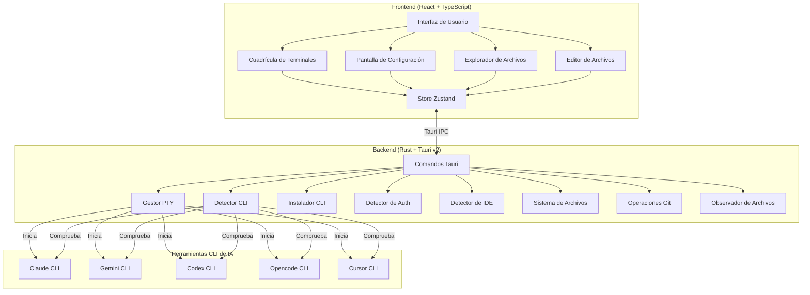
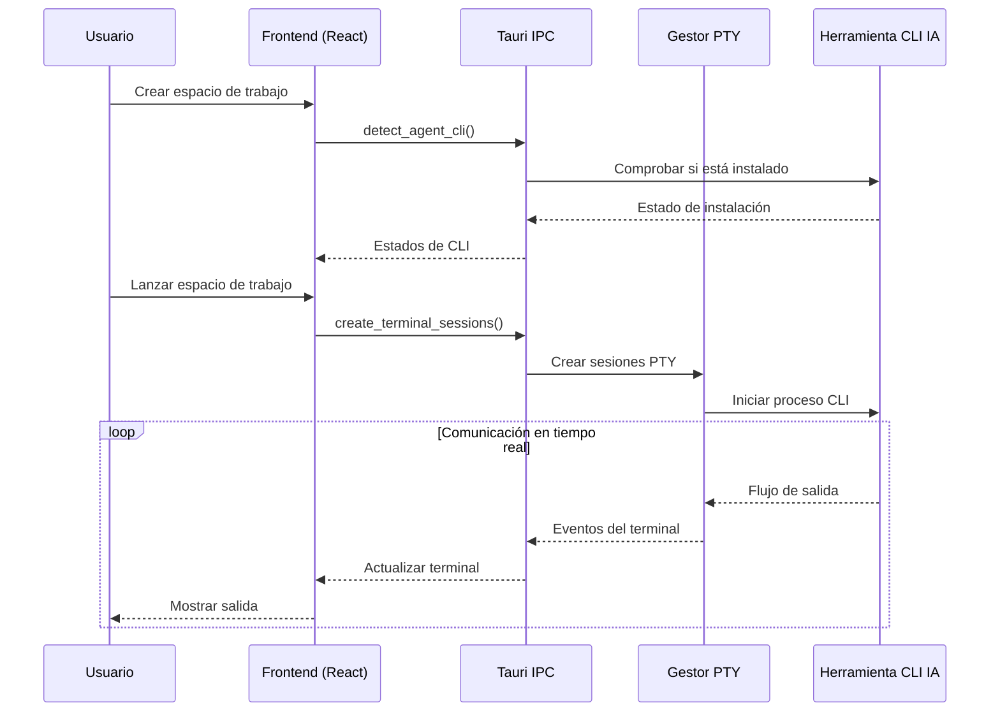

<div align="center">


# YzPzCode

### Tu equipo de programación con IA, a una sola ventana.

**Deja de lidiar con 5 terminales diferentes.** YzPzCode reúne a Claude, Gemini, Codex, Opencode y Cursor en una interfaz limpia y unificada.

[](https://github.com/wolfenazz/YzPzCode/stargazers)
[](https://tauri.app)
[](https://react.dev)
[](https://rust-lang.org)
[](LICENSE)

**[Instalar ahora](#-inicio-rápido)** · **[Ver capturas de pantalla](#-ver-la-app-en-acción)** · **[Leer la documentación](docs/userguid.md)**

---

</div>

## Espera, ¿qué es esto?

Imagina esto: estás programando. Quieres que Claude te explique código heredado, que Gemini genere tests, y que Codex te ayude con ese algoritmo complicado.

**¿El método antiguo?** Tres ventanas de terminal. Tres CLIs diferentes. Alternando como loco. Copiando y pegando entre ellas. Perdiendo la cabeza.

**¿El método YzPzCode?** Una sola app. Diseño en cuadrícula. Todos tus agentes IA uno al lado del otro, y puedes comparar sus respuestas.

## Ver la app en acción

<div align="center">


*Sí, es así de limpio.*

</div>

## Por qué te va a encantar

| Lo que obtienes | Por qué es genial |
|-----------------|-------------------|
| **Cuadrícula multi-agente** | Claude a la izquierda, Gemini a la derecha. Compara resultados al instante. Elige el ganador. |
| **Configuración con un clic** | ¿No sabes qué tienes instalado? Lo averiguaremos y te guiaremos con el resto. |
| **Preajustes de espacio de trabajo** | Guarda tus combinaciones de agentes favoritas. ¿Cuadrícula 3x2 con Claude + Gemini? Un solo clic. |
| **Terminales reales** | No es una simulación — son sesiones PTY reales con interactividad completa. |
| **Multiplataforma** | Windows, macOS, Linux. Tu SO, tu elección. |
| **Ligero** | Construido con Tauri, no con Electron. Tu RAM te lo agradecerá. |
| **Explorador de archivos integrado** | Navega tu proyecto, crea, renombra, elimina archivos sin salir de la app. |
| **Integración con Git** | Ve los cambios de archivos, estadísticas de diff y estado de git de un vistazo. |
| **Editor multitab** | Edita archivos con resaltado de sintaxis, previsualiza Markdown, PDF, imágenes y más. |
| **Lanzador de IDE** | Lanza VS Code, Cursor, Zed, IntelliJ y más de 6 IDEs directamente desde la app. |
| **Detección de autenticación** | Detecta automáticamente si tus CLIs de IA están autenticados y te guía en la configuración. |
| **Terminales externos** | Lanzar ventanas de terminal externas en mosaico cuando las necesites. |
| **Observador de archivos en vivo** | Ve los cambios de archivos en tiempo real mientras trabajas. |
| **Actualizaciones automáticas** | Mantén tu app actualizada con verificación de actualizaciones integrada. |

## Los Agentes

Soportamos a los pesos pesados:

<div align="center">

| Agente | CLI | Superpoder |
|--------|-----|------------|
| **Claude** | `claude` | Razonamiento profundo, explica código como un desarrollador senior paciente |
| **Gemini** | `gemini` | Rápido, multimodal, lo mejor de Google |
| **Codex** | `codex` | Generación de código que realmente funciona |
| **Opencode** | `opencode` | Libertad de código abierto |
| **Cursor** | `cursor` | Asistencia IA a nivel de IDE |

</div>

## Soporte de IDE

Lanza tu IDE favorito directamente desde YzPzCode:

| IDE | Binario | Plataforma |
|-----|---------|------------|
| **VS Code** | `code` | Todos |
| **Cursor** | `cursor` | Todos |
| **Zed** | `zed` | Todos |
| **Visual Studio** | `devenv` | Windows |
| **WebStorm** | `webstorm` | Todos |
| **IntelliJ** | `idea` | Todos |
| **Sublime Text** | `subl` | Todos |
| **Windsurf** | `windsurf` | Todos |
| **Perplexity** | `perplexity` | Todos |
| **Antigravity** | `antigravity` | Todos |

## Inicio rápido

**Necesitarás:** Node.js 18+ y Rust (última versión estable)

```bash
# 1. Clona el repositorio
git clone https://github.com/wolfenazz/YzPzCode.git
cd YzPzCode/app

# 2. Instala las dependencias
npm install

# 3. Ejecútalo
npm run tauri dev
```

¡Listo! La app detectará qué CLIs de IA tienes instalados y te ayudará a configurar el resto.

### Usuarios de macOS

**Instala Rust primero:**
```bash
curl --proto '=https' --tlsv1.2 -sSf https://sh.rustup.rs | sh
```
Luego reinicia tu terminal antes de ejecutar `npm run tauri dev`.

**¿Instalando desde un .dmg?** Como la app no está firmada con un certificado de desarrollador de Apple, verás una advertencia de seguridad. Así es cómo evitarla:

**Opción 1: Abrir con clic derecho**
1. Haz clic derecho (o Control-clic) en la app
2. Selecciona "Abrir" → Haz clic en "Abrir" en el diálogo

**Opción 2: Configuración del sistema**
1. Ve a **Configuración del sistema → Privacidad y seguridad**
2. Haz clic en "Abrir de todos modos" junto a la advertencia de seguridad

**Opción 3: Terminal**
```bash
xattr -cr /Applications/YzPzCode.app
```

La app es segura — está construida a partir de este repositorio de código abierto. La advertencia es solo macOS protegiéndote de apps sin firmar.

> **Nota:** Estamos trabajando para firmar correctamente la app con un certificado de desarrollador de Apple. Este proceso tarda unas semanas, pero una vez completado, la advertencia de seguridad ya no aparecerá.

<details>
<summary>¿Necesitas más detalles?</summary>

### Requisitos previos

- **Node.js** (v18+) — [Descárgalo aquí](https://nodejs.org)
- **Rust** (última versión estable) — [Consíguelo aquí](https://rust-lang.org)
- **pnpm** o npm — el que prefieras

### Build para producción

```bash
npm run tauri build
```

Esto genera un instalador nativo para tu plataforma. Pequeño, rápido, sin bloat.

</details>

## Cómo está construido

Elegimos herramientas que funcionan:

**Frontend**
- React 19 + TypeScript
- Vite (porque esperar a los builds es cosa del pasado)
- Tailwind CSS v4
- Zustand (gestión de estado con sentido común)
- xterm.js (renderizado de terminal)

**Backend**
- Tauri v2 (potenciado por Rust, ligero)
- portable-pty (pseudo-terminales reales)
- Tokio (async que escala)

### Arquitectura



### Flujo de datos



## Para los curiosos

```
app/
├── src-tauri/          # Backend en Rust
│   └── src/
│       ├── agent/           # Ejecución y orquestación de agentes
│       ├── agent_cli/       # Detección, instalación y lanzamiento de CLI
│       │   └── providers/   # Implementaciones específicas de proveedores
│       ├── commands/        # Gestores de Tauri IPC
│       ├── terminal/        # Gestión de sesiones PTY
│       ├── filesystem/      # Operaciones de archivos, git, observador
│       ├── ide/             # Detección y lanzamiento de IDE
│       └── utils/           # Utilidades
├── src/                     # Frontend en React
│   ├── components/
│   │   ├── setup/          # Pantallas de configuración
│   │   ├── workspace/       # Cuadrícula de terminales y sesiones
│   │   ├── explorer/       # Explorador de archivos y paneles de git
│   │   ├── editor/         # Editor de archivos multitab
│   │   ├── common/         # Componentes compartidos
│   │   └── feedback/       # Modal de comentarios
│   ├── hooks/              # Hooks personalizados de React
│   ├── stores/             # Gestión de estado Zustand
│   └── types/              # Definiciones TypeScript
└── docs/               # Documentación
```

## Contribuir

¡Nos encantaría tu ayuda! Así es como no volverte loco mientras desarrollas:

```bash
# Verificación de tipos
npx tsc --noEmit        # Frontend
cargo check             # Backend

# Linting y formateo
cargo clippy            # Detectar problemas en Rust
cargo fmt               # Darle formato bonito

# Tests
cd src-tauri && cargo test
```

¿Encontraste un bug? ¿Tienes una idea? [Abre un issue](https://github.com/wolfenazz/YzPzCode/issues) o [envía un PR](https://github.com/wolfenazz/YzPzCode/pulls).

Revisa la [hoja de ruta completa](docs/plane.md).

## Configuración recomendada

- [VS Code](https://code.visualstudio.com)
- [Extensión de Tauri](https://marketplace.visualstudio.com/items?itemName=tauri-apps.tauri-vscode)
- [rust-analyzer](https://marketplace.visualstudio.com/items?itemName=rust-lang.rust-analyzer)

O usa lo que te haga productivo. No estamos aquí para juzgar.

## Licencia

MIT. Haz fork, construye sobre ello, hazlo tuyo. Solo recuerda de dónde lo obtuviste.

---

<div align="center">

### ¿Te gusta lo que ves?

Si YzPzCode te salvó del caos de terminales, considera darle una **estrella** — ¡ayuda a otros a encontrarlo!

[](https://github.com/wolfenazz/YzPzCode/stargazers)

---

**Construido con cafeína y noches de desvelo por [Naseem](https://github.com/wolfenazz), Noor & Khalid**

*Para desarrolladores que prefieren programar antes que gestionar terminales.*

[Reportar un bug](https://github.com/wolfenazz/YzPzCode/issues) · [Solicitar una función](https://github.com/wolfenazz/YzPzCode/issues) · [Contribuir](https://github.com/wolfenazz/YzPzCode/pulls)

</div>
