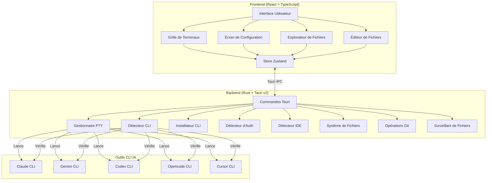
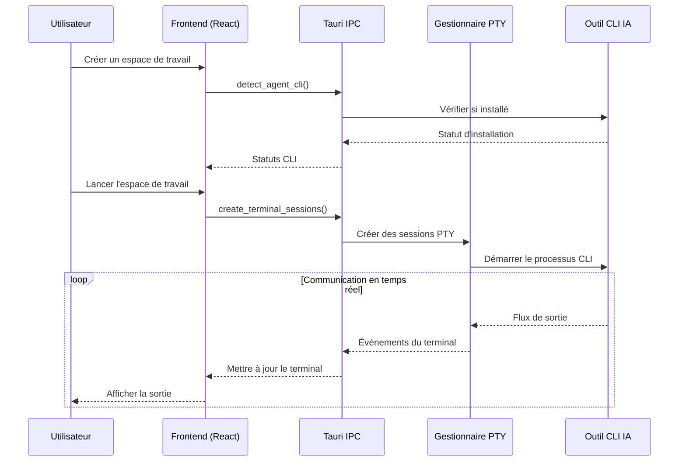

<div align="center">


# YzPzCode

### Votre équipe de codage IA, à une seule fenêtre.

**Arrêtez de jongler entre 5 terminaux différents.** YzPzCode rassemble Claude, Gemini, Codex, Opencode et Cursor dans une interface propre et unifiée.

[](https://github.com/wolfenazz/YzPzCode/stargazers)
[](https://tauri.app)
[](https://react.dev)
[](https://rust-lang.org)
[](LICENSE)

**[Installer maintenant](#-démarrage-rapide)** · **[Voir les captures d'écran](#-voir-lapplication-en-action)** · **[Lire la documentation](docs/userguid.md)**

---

</div>

## Attendez, c'est quoi ?

Imaginez ça : vous êtes en train de coder. Vous voulez que Claude vous explique du code hérité, que Gemini génère des tests, et que Codex vous aide avec cet algorithme épineux.

**L'ancienne méthode ?** Trois fenêtres de terminal. Trois CLI différents. Alt-tab comme un fou. Copier-coller entre eux. Perdre la tête.

**La méthode YzPzCode ?** Une seule application. Disposition en grille. Tous vos agents IA côte à côte, et vous pouvez comparer leurs réponses.

## Voir l'application en action

<div align="center">


*Oui, c'est aussi propre.*

</div>

## Pourquoi vous allez l'adorer

| Ce que vous obtenez | Pourquoi c'est génial |
|---------------------|----------------------|
| **Grille multi-agents** | Claude à gauche, Gemini à droite. Comparez les résultats instantanément. Choisissez le meilleur. |
| **Configuration en un clic** | Vous ne savez pas ce qui est installé ? On va le découvrir et vous guider pour le reste. |
| **Préréglages d'espace de travail** | Enregistrez vos combinaisons d'agents préférées. Grille 3x2 avec Claude + Gemini ? Un seul clic. |
| **Terminaux réels** | Pas une simulation — ce sont de véritable sessions PTY avec une interactivité complète. |
| **Multiplateforme** | Windows, macOS, Linux. Votre OS, votre choix. |
| **Léger** | Construit avec Tauri, pas Electron. Votre RAM vous remerciera. |
| **Explorateur de fichiers intégré** | Naviguez dans votre projet, créez, renommez, supprimez des fichiers sans quitter l'app. |
| **Intégration Git** | Voyez les changements de fichiers, les statistiques de diff et le statut git en un coup d'œil. |
| **Éditeur multi-onglets** | Modifiez des fichiers avec coloration syntaxique, prévisualisez Markdown, PDF, images et plus. |
| **Lanceur d'IDE** | Lancez VS Code, Cursor, Zed, IntelliJ et plus de 6 autres IDEs directement depuis l'app. |
| **Détection d'authentification** | Détecte automatiquement si vos CLIs IA sont authentifiés et vous guide pour la configuration. |
| **Terminaux externes** | Lancez des fenêtres de terminal externes en mosaïque quand vous en avez besoin. |
| **Surveillance des fichiers en direct** | Voyez les changements de fichiers en temps réel pendant que vous travaillez. |
| **Mises à jour automatiques** | Gardez votre app à jour avec la vérification des mises à jour intégrée. |

## Les Agents

Nous prenons en charge les poids lourds :

<div align="center">

| Agent | CLI | Super-pouvoir |
|-------|-----|---------------|
| **Claude** | `claude` | Raisonnement approfondi, explique le code comme un développeur senior patient |
| **Gemini** | `gemini` | Rapide, multimodal, le meilleur de Google |
| **Codex** | `codex` | Génération de code qui fonctionne vraiment |
| **Opencode** | `opencode` | Liberté open-source |
| **Cursor** | `cursor` | Assistance IA au niveau d'un IDE |

</div>

## Support IDE

Lancez votre IDE préféré directement depuis YzPzCode:

| IDE | Binaire | Plateforme |
|-----|---------|------------|
| **VS Code** | `code` | Toutes |
| **Cursor** | `cursor` | Toutes |
| **Zed** | `zed` | Toutes |
| **Visual Studio** | `devenv` | Windows |
| **WebStorm** | `webstorm` | Toutes |
| **IntelliJ** | `idea` | Toutes |
| **Sublime Text** | `subl` | Toutes |
| **Windsurf** | `windsurf` | Toutes |
| **Perplexity** | `perplexity` | Toutes |
| **Antigravity** | `antigravity` | Toutes |

## Démarrage rapide

**Vous aurez besoin de :** Node.js 18+ et Rust (dernière version stable)

```bash
# 1. Cloner le dépôt
git clone https://github.com/wolfenazz/YzPzCode.git
cd YzPzCode/app

# 2. Installer les dépendances
npm install

# 3. Lancer l'application
npm run tauri dev
```

Et voilà. L'application détectera quels CLIs IA vous avez installés et vous aidera à configurer le reste.

### Utilisateurs macOS

**Installez d'abord Rust :**
```bash
curl --proto '=https' --tlsv1.2 -sSf https://sh.rustup.rs | sh
```
Puis redémarrez votre terminal avant de lancer `npm run tauri dev`.

**Installation depuis un .dmg ?** Comme l'application n'est pas signée avec un certificat de développeur Apple, vous verrez un avertissement de sécurité. Voici comment le contourner :

**Option 1 : Ouvrir avec un clic droit**
1. Faites un clic droit (ou Control-clic) sur l'application
2. Sélectionnez « Ouvrir » → Cliquez sur « Ouvrir » dans la boîte de dialogue

**Option 2 : Paramètres système**
1. Allez dans **Paramètres système → Confidentialité et sécurité**
2. Cliquez sur « Ouvrir quand même » à côté de l'avertissement de sécurité

**Option 3 : Terminal**
```bash
xattr -cr /Applications/YzPzCode.app
```

L'application est sûre — elle est construite à partir de ce dépôt open-source. L'avertissement est simplement macOS qui vous protège des applications non signées.

> **Note :** Nous travaillons à signer correctement l'application avec un certificat de développeur Apple. Ce processus prend quelques semaines, mais une fois terminé, l'avertissement de sécurité n'apparaîtra plus.

<details>
<summary>Besoin de plus de détails ?</summary>

### Prérequis

- **Node.js** (v18+) — [Télécharger ici](https://nodejs.org)
- **Rust** (dernière version stable) — [Obtenez-le ici](https://rust-lang.org)
- **pnpm** ou npm — celui que vous préférez

### Build pour la production

```bash
npm run tauri build
```

Cela génère un installateur natif pour votre plateforme. Petit, rapide, sans superflu.

</details>

## Comment c'est construit

Nous avons choisi des outils qui font le travail :

**Frontend**
- React 19 + TypeScript
- Vite (parce qu'attendre les builds, c'est dépassé)
- Tailwind CSS v4
- Zustand (gestion d'état qui a du sens)
- xterm.js (rendu du terminal)

**Backend**
- Tauri v2 (propulsé par Rust, léger)
- portable-pty (vrais pseudo-terminaux)
- Tokio (async qui passe à l'échelle)

### Architecture



### Flux de données



## Pour les curieux

```
app/
├── src-tauri/          # Backend Rust
│   └── src/
│       ├── agent/           # Exécution et orchestration des agents
│       ├── agent_cli/      # Détection, installation et lancement de CLI
│       │   └── providers/  # Implémentations spécifiques aux fournisseurs
│       ├── commands/       # Gestionnaires Tauri IPC
│       ├── terminal/       # Gestion des sessions PTY
│       ├── filesystem/     # Opérations fichiers, git, surveillant
│       ├── ide/            # Détection et lancement d'IDE
│       └── utils/          # Utilitaires
├── src/                     # Frontend React
│   ├── components/
│   │   ├── setup/          # Écrans de configuration
│   │   ├── workspace/      # Grille de terminaux et sessions
│   │   ├── explorer/       # Explorateur de fichiers et panneaux git
│   │   ├── editor/         # Éditeur de fichiers multi-onglets
│   │   ├── common/        # Composants partagés
│   │   └── feedback/      # Modal de commentaires
│   ├── hooks/              # Hooks personnalisés React
│   ├── stores/             # Gestion d'état Zustand
│   └── types/              # Définitions TypeScript
└── docs/               # Documentation
```

## Contribuer

Nous serions ravis de votre aide ! Voici comment rester sain d'esprit pendant le développement :

```bash
# Vérification des types
npx tsc --noEmit        # Frontend
cargo check             # Backend

# Linting et formatage
cargo clippy            # Attraper les problèmes Rust
cargo fmt               # Rendre ça joli

# Tests
cd src-tauri && cargo test
```

Vous avez trouvé un bug ? Vous avez une idée ? [Ouvrez un ticket](https://github.com/wolfenazz/YzPzCode/issues) ou [soumettez une PR](https://github.com/wolfenazz/YzPzCode/pulls).

Consultez la [feuille de route complète](docs/plane.md).

## Configuration recommandée

- [VS Code](https://code.visualstudio.com)
- [Extension Tauri](https://marketplace.visualstudio.com/items?itemName=tauri-apps.tauri-vscode)
- [rust-analyzer](https://marketplace.visualstudio.com/items?itemName=rust-lang.rust-analyzer)

Ou utilisez ce qui vous rend productif. Nous ne sommes pas là pour juger.

## Licence

MIT. Fork-le, construis dessus, fais-le tien. N'oublie juste d'où tu l'as eu.

---

<div align="center">

### Vous aimez ce que vous voyez ?

Si YzPzCode vous a sauvé du chaos des terminaux, pensez à lui donner une **étoile** — ça aide les autres à le trouver !

[](https://github.com/wolfenazz/YzPzCode/stargazers)

---

**Construit avec de la caféine et des nuits blanches par [Naseem](https://github.com/wolfenazz), Noor & Khalid**

*Pour les développeurs qui préfèrent coder plutôt que gérer des terminaux.*

[Signaler un bug](https://github.com/wolfenazz/YzPzCode/issues) · [Demander une fonctionnalité](https://github.com/wolfenazz/YzPzCode/issues) · [Contribuer](https://github.com/wolfenazz/YzPzCode/pulls)

</div>
