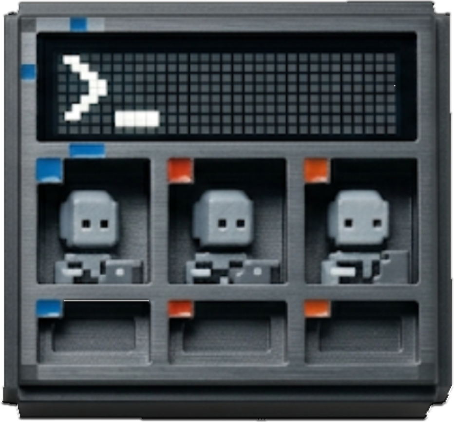

<div align="center">



# YzPzCode

**Your AI Coding Squad, One Window Away.**

Stop juggling 5 different terminals. YzPzCode brings Claude, Gemini, Codex, Opencode, and Cursor together in one clean interface.

[](https://tauri.app)
[](https://react.dev)
[](https://rust-lang.org)
[](LICENSE)

[Get Started](#-quick-start) · [Screenshots](#-screenshots) · [Docs](docs/userguid.md)

</div>

---

## The Problem

You're a developer. You use AI coding assistants. Great choice.

But here's the thing — each one lives in its own world. Claude here, Gemini there, Codex somewhere else. Before you know it, you've got 7 terminal windows open, your screen is chaos, and you're copy-pasting between them like it's 2010.

**YzPzCode fixes this.**

One app. Multiple AI agents. Side-by-side terminals. Done.

## Screenshots

<div align="center">


</div>

## What You Get

| Feature | Why It Matters |
|---------|----------------|
| Multi-Agent Grid | Run Claude, Gemini, and Codex side-by-side. Compare outputs. Pick the best. |
| One-Click Setup | Detects what's installed, guides you through what's missing |
| Workspace Presets | Save your favorite agent combinations and layouts |
| Real Terminals | Not a simulation — actual PTY sessions with full interactivity |
| Cross-Platform | Windows, Mac, Linux. We don't discriminate. |

## Supported Agents

We play nice with the major players:

| Agent | Status | What It's Good At |
|-------|--------|-------------------|
| **Claude** (Anthropic) | Ready | Long-context reasoning, code explanation |
| **Gemini** (Google) | Ready | Fast responses, multimodal |
| **Codex** (OpenAI) | Ready | Code generation, completions |
| **Opencode** | Ready | Open-source flexibility |
| **Cursor** | Ready | IDE-style AI assistance |

## Quick Start

Got Node.js and Rust? You're 90% there.

```bash
git clone https://github.com/wolfenazz/YzPzCode.git
cd YzPzCode/app
npm install
npm run tauri dev
```

That's it. The app will guide you through detecting and installing any missing AI CLIs.

### Prerequisites

- **Node.js** 18+ — [Download here](https://nodejs.org)
- **Rust** (latest stable) — [Get it here](https://rust-lang.org)
- **pnpm** or npm — Your choice

## Building for Production

```bash
npm run tauri build
```

Outputs a native installer for your platform. No Electron bloat — Tauri keeps it lean.

## Under the Hood

Built with tools we actually like using:

**Frontend**
- React 19 + TypeScript (type-safe, modern)
- Vite (fast builds)
- Tailwind CSS v4 (utility-first styling)
- Zustand (state management that stays out of your way)
- xterm.js (terminal rendering)

**Backend**
- Tauri v2 (Rust-powered desktop)
- portable-pty (real pseudo-terminals)
- Tokio (async that scales)

## Project Layout

```
app/
├── src-tauri/          # Rust backend
│   └── src/
│       ├── agent/      # Agent orchestration
│       ├── agent_cli/  # CLI detection, installation, launching
│       ├── commands/   # Tauri IPC handlers
│       └── terminal/   # PTY session management
├── src/                # React frontend
│   ├── components/     # UI components
│   ├── hooks/          # Custom React hooks
│   ├── stores/         # Zustand stores
│   └── types/          # TypeScript definitions
└── docs/               # Documentation
```

## For Contributors

We welcome PRs. Here's how to stay sane while developing:

```bash
# Type checking
npx tsc --noEmit        # Frontend
cargo check             # Backend

# Linting
cargo clippy            # Rust linter
cargo fmt               # Format Rust code

# Testing
cd src-tauri && cargo test
```

Check [docs/plane.md](docs/plane.md) for the full plan.

## Recommended Setup

- [VS Code](https://code.visualstudio.com) + [Tauri Extension](https://marketplace.visualstudio.com/items?itemName=tauri-apps.tauri-vscode) + [rust-analyzer](https://marketplace.visualstudio.com/items?itemName=rust-lang.rust-analyzer)
- Or whatever IDE makes you happy. We're not picky.

## License

MIT. Use it, fork it, improve it. Just give credit where it's due.

---

<div align="center">

**Made with caffeine and late nights by Naseem, Noor & Khalid**

*For developers who'd rather code than manage terminals.*

[Report a Bug](https://github.com/wolfenazz/YzPzCode/issues) · [Request a Feature](https://github.com/wolfenazz/YzPzCode/issues)

</div>
