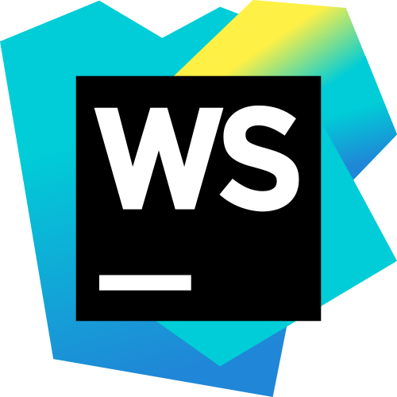
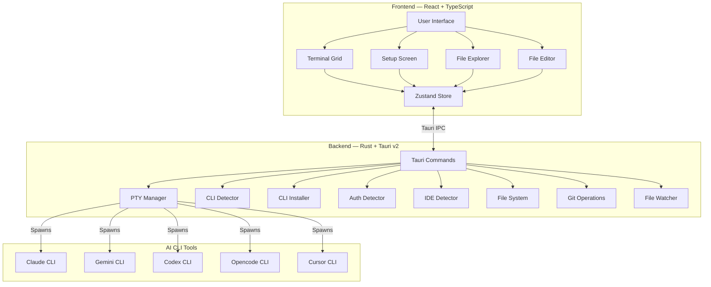

<div align="center">


<h1>YzPzCode</h1>

<p><strong>Your AI Development Ecosystem, Unified.</strong></p>

<p><i>Consolidate Claude, Gemini, Codex, Opencode, and Cursor into a single, cohesive interface.<br>Eliminate context switching and optimize your development workflow.</i></p>

[](https://github.com/wolfenazz/YzPzCode/stargazers)
[](https://tauri.app)
[](https://react.dev)
[](https://rust-lang.org)
[](LICENSE)

<br>

[**Download Latest Release**](https://github.com/wolfenazz/YzPzCode/releases) · [**View Documentation**](docs/userguid.md) · [**Report an Issue**](https://github.com/wolfenazz/YzPzCode/issues)

</div>

---

## The Objective

Modern development often requires managing multiple AI assistants across disparate terminal windows. YzPzCode centralizes this process, transforming a fragmented workflow into an integrated command center.

| Traditional Workflow | The YzPzCode Architecture |
| :--- | :--- |
| Multiple fragmented terminal windows | **Single unified application** |
| Disconnected command-line interfaces | **Integrated agent ecosystem** |
| Constant application switching | **Side-by-side grid visualization** |
| Manual code transfer between tools | **Instantaneous cross-comparison** |
| Fragmented workspace | **Persistent, saved environment states** |

---

## Interface Preview

<div align="center">


<br><br>


<br><br>
<i>Engineered for speed, clarity, and performance.</i>

</div>

---

## Core Capabilities

<table>
<tr>
<td><b>Multi-Agent Grid</b><br><sub>Run Claude, Gemini, and Codex in synchronized, side-by-side views.</sub></td>
<td><b>Automated Initialization</b><br><sub>Instantly detect and configure locally installed CLIs.</sub></td>
<td><b>Workspace Presets</b><br><sub>Save and restore optimal agent combinations for specific workflows.</sub></td>
<td><b>Native Terminals</b><br><sub>Powered by actual PTY sessions for authentic CLI interaction.</sub></td>
</tr>
<tr>
<td><b>Cross-Platform Support</b><br><sub>Optimized binaries for Windows, macOS, and Linux.</sub></td>
<td><b>Resource Efficient</b><br><sub>Built on Tauri and Rust, utilizing a fraction of the RAM required by Electron.</sub></td>
<td><b>Integrated Explorer</b><br><sub>Manage files and directories without leaving the application.</sub></td>
<td><b>Git Integration</b><br><sub>Monitor repository status and diff statistics at a glance.</sub></td>
</tr>
<tr>
<td><b>Multi-Tab Editor</b><br><sub>Built-in syntax highlighting and file preview capabilities.</sub></td>
<td><b>IDE Integration</b><br><sub>Seamlessly launch into over 10 supported development environments.</sub></td>
<td><b>Authentication Tracking</b><br><sub>Monitor credential states across all active CLI tools.</sub></td>
<td><b>Continuous Delivery</b><br><sub>Automated update mechanisms ensure access to the latest features.</sub></td>
</tr>
</table>

---

## Supported AI CLI Agents

<div align="center">

<table>
<tr>
<td align="center" width="140">

<br><br><b>Claude</b><br><code>claude</code>
</td>
<td align="center" width="140">

<br><br><b>Gemini</b><br><code>gemini</code>
</td>
<td align="center" width="140">

<br><br><b>Codex</b><br><code>codex</code>
</td>
<td align="center" width="140">

<br><br><b>Opencode</b><br><code>opencode</code>
</td>
<td align="center" width="140">

<br><br><b>Cursor</b><br><code>cursor</code>
</td>
</tr>
</table>

</div>

---

## Supported Development Environments

<div align="center">

<table>
<tr>
<td align="center" width="100">
<br><sub>VS Code</sub>
</td>
<td align="center" width="100">
<br><sub>Cursor</sub>
</td>
<td align="center" width="100">
<br><sub>Zed</sub>
</td>
<td align="center" width="100">
<br><sub>Visual Studio</sub>
</td>
<td align="center" width="100">
<br><sub>WebStorm</sub>
</td>
</tr>
<tr>
<td align="center">
<br><sub>IntelliJ</sub>
</td>
<td align="center">
<br><sub>Sublime Text</sub>
</td>
<td align="center">
<br><sub>Windsurf</sub>
</td>
<td align="center">
<br><sub>Perplexity</sub>
</td>
<td align="center">
<br><sub>Antigravity</sub>
</td>
</tr>
</table>

</div>

---

## Installation & Setup

> **Prerequisites:** Node.js 18+ and Rust (latest stable build).

```bash
# 1. Clone the repository
git clone [https://github.com/wolfenazz/YzPzCode.git](https://github.com/wolfenazz/YzPzCode.git)
cd YzPzCode/app

# 2. Install dependencies
npm install

# 3. Initialize development environment
npm run tauri dev
````

Upon launch, the application will automatically detect installed AI CLIs and guide you through the initial configuration.

\<details\>
\<summary\>\<b\>macOS Specific Instructions\</b\>\</summary\>

<br>

**1. Install Rust Toolchain:**

```bash
curl --proto '=https' --tlsv1.2 -sSf [https://sh.rustup.rs](https://sh.rustup.rs) | sh
```

*Restart your terminal environment before executing `npm run tauri dev`.*

**2. Gatekeeper Workarounds (for .dmg installations):**
As the application is pending official Apple Developer certification, you may encounter Gatekeeper restrictions. Bypass using one of the following methods:

  * **Context Menu:** Right-click the `.app` file → Select "Open" → Confirm "Open".
  * **System Settings:** Navigate to System Settings → Privacy & Security → Select "Open Anyway".
  * **Terminal Bypass:** Execute `xattr -cr /Applications/YzPzCode.app`.

\</details\>

\<details\>
\<summary\>\<b\>Production Build Compilation\</b\>\</summary\>

<br>

```bash
npm run tauri build
```

*This command generates a highly optimized, native installer specific to your operating system.*

\</details\>

-----

## Technical Architecture

\<div align="center"\>

| System Layer | Technology Stack |
|:---:|:---|
| **Frontend UI** | React 19, TypeScript, Vite, Tailwind CSS v4, Zustand, xterm.js |
| **Backend Core** | Tauri v2 (Rust), portable-pty, Tokio (Asynchronous Runtime) |

\</div\>



-----

## Repository Structure

```text
app/
├── src-tauri/                      # Rust Core Backend
│   └── src/
│       ├── agent/                  # Agent task execution & orchestration
│       ├── agent_cli/              # CLI detection, installation & execution
│       │   └── providers/          # Provider-specific implementations
│       ├── commands/               # Tauri IPC handler definitions
│       ├── terminal/               # PTY session lifecycle management
│       ├── filesystem/             # File I/O, git indexing, watchers
│       ├── ide/                    # IDE detection routing
│       └── utils/                  # Core utility functions
├── src/                            # React Client Frontend
│   ├── components/
│   │   ├── setup/                  # Configuration & onboarding UI
│   │   ├── workspace/              # Terminal grid components
│   │   ├── explorer/               # Directory tree & git status panels
│   │   ├── editor/                 # Multi-tab integrated editor
│   │   ├── common/                 # Shared UI primitives
│   │   └── feedback/               # Application telemetry & feedback
│   ├── hooks/                      # React lifecycle hooks
│   ├── stores/                     # Zustand state management slices
│   └── types/                      # Global TypeScript interfaces
└── docs/                           # Project documentation & guides
```

-----

## Development & Contribution

We adhere to strict typing and formatting standards. Please ensure all checks pass before submitting pull requests.

```bash
# Static Analysis
npx tsc --noEmit          # Verify frontend TypeScript
cargo check               # Verify backend Rust

# Linting and Code Formatting
cargo clippy              # Enforce Rust idioms
cargo fmt                 # Apply standard formatting

# Unit Testing
cd src-tauri && cargo test
```

For bug reports or feature requests, please consult the [Issue Tracker](https://github.com/wolfenazz/YzPzCode/issues). Review our [Development Roadmap](https://www.google.com/search?q=docs/plane.md) for upcoming features.

-----

## License & Legal

This software is distributed under the [MIT License](https://www.google.com/search?q=LICENSE).

-----

<br>

\<div align="center"\>

**Project Leadership & Contributors**

\<table\>
\<tr\>
\<td align="center" width="150"\>
\<a href="https://github.com/wolfenazz" style="text-decoration: none; color: inherit;"\>
\
<br><br>
\<b\>Naseem\</b\>
<br>
\<sub\>Creator & Lead Architect\</sub\>
\</a\>
\</td\>
\<td align="center" width="150"\>
\<a href="https://github.com/Noor-Al-Khelaifi" style="text-decoration: none; color: inherit;"\>
\
<br><br>
\<b\>Noor\</b\>
<br>
\<sub\>Core Contributor\</sub\>
\</a\>
\</td\>
\</tr\>
\</table\>

<br>

[View Repository](https://www.google.com/search?q=https://github.com/wolfenazz/YzPzCode)

\</div\>
